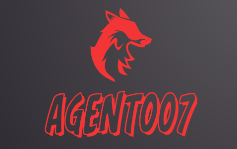

<div align="center">

</div>
<h1 align='center'>agent007 </h1>
<br/>
<br/>

# [Description](#description):
This is a simple Telegram bot application that starts with the start up of the system. 
The bot monitor user activity in the absence of the user. The bot simply takes screenshot of the the cureent window within a time interval and sends it to the telegram user of the device.The bot starts with detecting the first message of the user and register using  `/register + Name,Department,Title(Designation)` command from the telegram. The bot is designed to monitor un-usual activity of the device of a specific user. The user gets a message when someone logged in their user and sends user name via telegram mentioning which user is logged in. The bot is able to control the device through command prompt (executing command in the shel). The bot has other command to notifiy the intruder and can shutdown immediately to prevent malicious activity. If  a user register through the `/register` command then a user is created in the database. After registering the user then the application starts taking screenshots in the current working directory and also the file reference in the database.The user can simply integrate the apis provided by the bot service to make a dashboard to observe the activity.


## [Features](#features):
* **Take screenshot withing a time interval and send it through the telegram.**
* **Alert system when the screenshot is taken.**
* **Custom command to notify the intruder <br/>**
    `/register+ Name,Department,Designation` for registering a user .<br/>
    `/peep + Custom messag` to notify the intruder.<br/>
    `/notify + Message` to send message to the intruder .<br/>
    `/shutdwon + Message` to to shutdown the device immediately.<br/>
    `/exec :shel-command` to execute any command through CLI .<br/>
    `/whoami` to get the current user info. <br/>
* **User management throught rest APIs**
* **Image management through rest APIS**
* **Maintain multiple user via `admin` role in user.**

## [Installation](#installation)

```bash
git clone -url

cd project-driectory

yarn or npm intall

yarn dev  or npm run dev
```

For the linux user you need to install an additional package,install by running<br/>
```bash
sudo apt-get install imagemagick
```
Before starting the application remember providing the enviroment variables:<br/>

```js
BOT_TOKEN= bot_token
INTERVAL= screenshot_interval
CACHE_DIR= 'cache'
CACHE_FILE= 'log.txt'
FILE_DIR= 'screenshots'
SECRET_KEY= your_scret_key
SECRET_FILE= 'shh.txt'
COOKIE_KEY= "agent"
HASING_KEY= your_hashing_key
MONOGODB_URL= mongodb_url
LOCAL_STORAGE= "creds.json"
PORT= your_desired_port
```

## [Technologies used](#technologies-used):

* [telegraf.js](https://telegrafjs.org/#/)
* [Node.js](https://nodejs.org/en)
* [Typescript](https://www.typescriptlang.org/)
* [screenshot-desktop](https://www.npmjs.com/package/screenshot-desktop)
* [Express.js](https://expressjs.com/)
* [mongoose](https://mongoosejs.com/)
* [node-notifier](https://www.npmjs.com/package/node-notifier)
* [jsonwebtoken](https://www.npmjs.com/package/jsonwebtoken) and many more..

## [Feedback](#feedback)

If you have any feedback, please reach out to us at prantodas043@gmail.com

## [Inspired by](#inspired-by) :
[Rakibul Yeasin](https://github.com/dreygur)

## [Authors](#authors)

 [Pranta Das](https://www.github.com/Prantadas)
